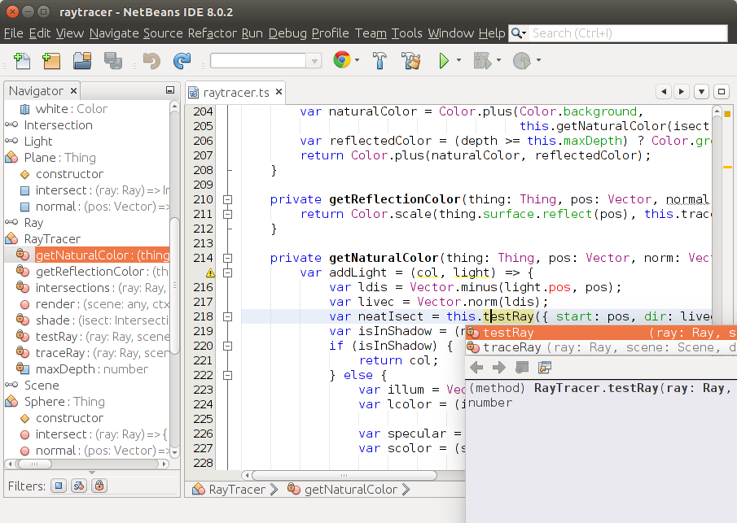

## NetBeans TypeScript Editor

This plugin allows editing of TypeScript code within NetBeans. Many IDE features are supported:

* Code completion
* Error checking
* Find usages
* Go to Declaration
* Syntax highlighting

### Installation

For this plugin to work, you will need to have Node.js version 0.8.0 or later installed.

Download the latest netbeanstypescript.nbm file from the [Releases](https://github.com/Everlaw/nbts/releases) page. Then, in NetBeans, go to Tools > Plugins, and select the "Downloaded" tab. Click "Add Plugins..." and locate the netbeanstypescript.nbm file. The TypeScript Editor should appear in the list. Select it and click "Install".

### Notes

* All .ts/.tsx files under one source root are currently assumed to be part of one TypeScript project.
* By default, "implicit any" errors are enabled, but are shown as warnings rather than errors. You may explicitly specify `"noImplicitAny": false` in a TypeScript project's tsconfig.json to disable "implicit any" errors altogether.

### Versioning

The version number of this plugin reflects the version of TypeScript it incorporates (currently 1.8.5), with an extra digit for new versions that do not involve a TypeScript update. We intend to keep this plugin up to date with new versions of TypeScript when they come out.

### Contributing

We are happy to receive Pull Requests. If you are planning a big change, it's probably best to discuss it as an [Issue](https://github.com/Everlaw/nbts/issues) first.

### Building

To build the plugin yourself, there are a couple of things that must be done first:
* Edit this line in `build.xml` to point to where you have TypeScript installed:  
  `<property name="typescript" value="${env.HOME}/TypeScript-1.8.5"/>`
* Open the project in NetBeans. (You can either build in NetBeans or run `ant` from the command line, but either way you must open the project first to create the `nbproject/private` files.)
